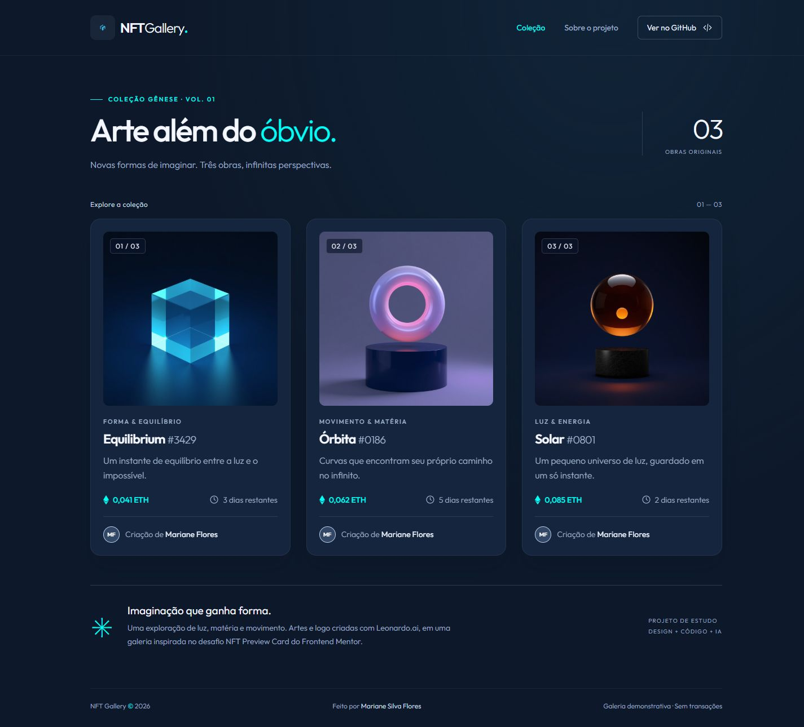
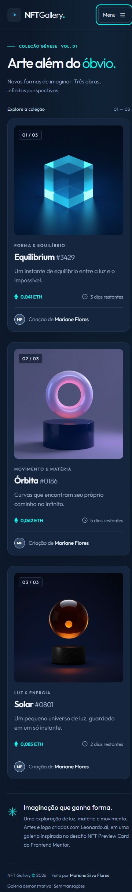

# NFT Gallery ✦

Galeria responsiva de arte digital por **Mariane Silva Flores**, inspirada no desafio NFT Preview Card Component do Frontend Mentor. A coleção Gênese reúne três obras originais sobre luz, matéria e movimento.

**[Acessar a aplicação](https://marianesilvaflores.github.io/nft-gallery/)** · **[Repositório](https://github.com/marianesilvaflores/nft-gallery)**



## Atividade 3 — Projeto do semestre atual

Este projeto foi desenvolvido como tarefa de uma disciplina deste semestre e está sendo utilizado na Atividade 3 de publicação e organização de repositórios no GitHub.

| Requisito da atividade | Como foi atendido |
| --- | --- |
| Publicar uma atividade do semestre atual | Projeto NFT Gallery, com os componentes NftCard, CardList e Header |
| Criar um README | Este documento apresenta funcionalidades, tecnologias, execução, imagens e autoria |
| Configurar o gitignore | O arquivo `.gitignore` exclui `node_modules/`, `dist/`, arquivos `.env` e arquivos do sistema |

O `.env.example`, caso seja criado com valores ilustrativos, pode ser versionado para documentar configurações. O projeto atual não exige variáveis de ambiente.

**Link para entrega:** [github.com/marianesilvaflores/nft-gallery](https://github.com/marianesilvaflores/nft-gallery).

## Funcionalidades

- `NftCard`: imagem, descrição, preço ilustrativo, prazo e autoria.
- `CardList`: lista reutilizável com dados independentes e três obras diferentes.
- Imagens e logo geradas no **Leonardo.ai**.
- Header responsivo com menu mobile, fechamento por Escape e retorno do foco.
- Grid de uma, duas ou três colunas para mobile, tablet e desktop.
- Entrada sequencial com **Animate.css** e hover com elevação, zoom e sobreposição ciano.
- Foco visível, textos alternativos, link para pular a navegação e suporte a movimento reduzido.
- Publicação automática no GitHub Pages após alterações na `main`.

Preços e prazos são fictícios e estáticos. Esta é uma demonstração de interface, sem carteiras ou transações.

## Tecnologias

React 19 · JavaScript · Vite 8 · CSS Grid e Flexbox · Animate.css 4 · Google Fonts (Outfit) · GitHub Actions · GitHub Pages.

As imagens ficam no repositório. A fonte é carregada do Google Fonts, com fallback para sans-serif.

## Mobile



## Executar localmente

Requer Node.js 22.12 ou superior e npm.

```bash
git clone https://github.com/marianesilvaflores/nft-gallery.git
cd nft-gallery
npm ci
npm run dev
```

Abra o endereço indicado pelo Vite, normalmente `http://127.0.0.1:5173/nft-gallery/`.

```bash
npm run build
npm run preview
```

O build é gerado em `dist/`. A opção `base: '/nft-gallery/'` permite carregar os arquivos no GitHub Pages.

## Fases e branches

| Branch                 | Entrega                                                             |
| ---------------------- | ------------------------------------------------------------------- |
| `feature/nft-card`     | Estrutura React/Vite, card, imagem original, responsividade e hover |
| `feature/card-list`    | Lista, obras e dados distintos, animação de entrada                 |
| `feature/header`       | Logo, header, menu mobile e documentação                            |
| `feature/github-pages` | Publicação automatizada e validação final                           |

As fases são integradas na `main` com merges que preservam o histórico. Os commits da implementação do desafio NFT são em inglês e separados por mudanças concretas. A atualização documental para a Atividade 3 foi registrada em português na branch `docs/atividade-3`.

## Organização

```text
src/components/   NftCard, CardList e Header
src/App.jsx       Composição da galeria
src/data.js       Dados das obras
src/styles.css    Layout e interações
public/           Artes, logo e favicon
docs/             Capturas e registro de geração
.github/workflows/deploy.yml
```

## Design e imagens

- [Frontend Mentor](https://www.frontendmentor.io/challenges/nft-preview-card-component-SbdUL_w0U): estrutura do card, paleta azul-marinho/ciano e hover.
- [OpenSea](https://opensea.io/): inspiração para a organização de coleções e navegação da galeria.
- [Leonardo.ai](https://app.leonardo.ai/): três obras e símbolo da marca; modelo Lucid Origin, estilo Dynamic, proporção 1:1.
- [Animate.css](https://animate.style/): animação `fadeInUp` com atraso progressivo.

Os prompts estão em [docs/artwork.md](docs/artwork.md). O favicon foi desenhado em SVG; a logo do header foi gerada no Leonardo.ai.

## Validação

- Build de produção e carregamento das quatro imagens.
- Layout em 320, 375, 768 e 1440 pixels sem rolagem horizontal.
- Menu mobile por teclado, Escape e retorno do foco.
- Capturas reais em desktop e mobile.

## Autora

**Mariane Silva Flores** — [@marianesilvaflores](https://github.com/marianesilvaflores)

Projeto de estudo desenvolvido com assistência de IA. Design base: Frontend Mentor. Artes e logo: Leonardo.ai.
